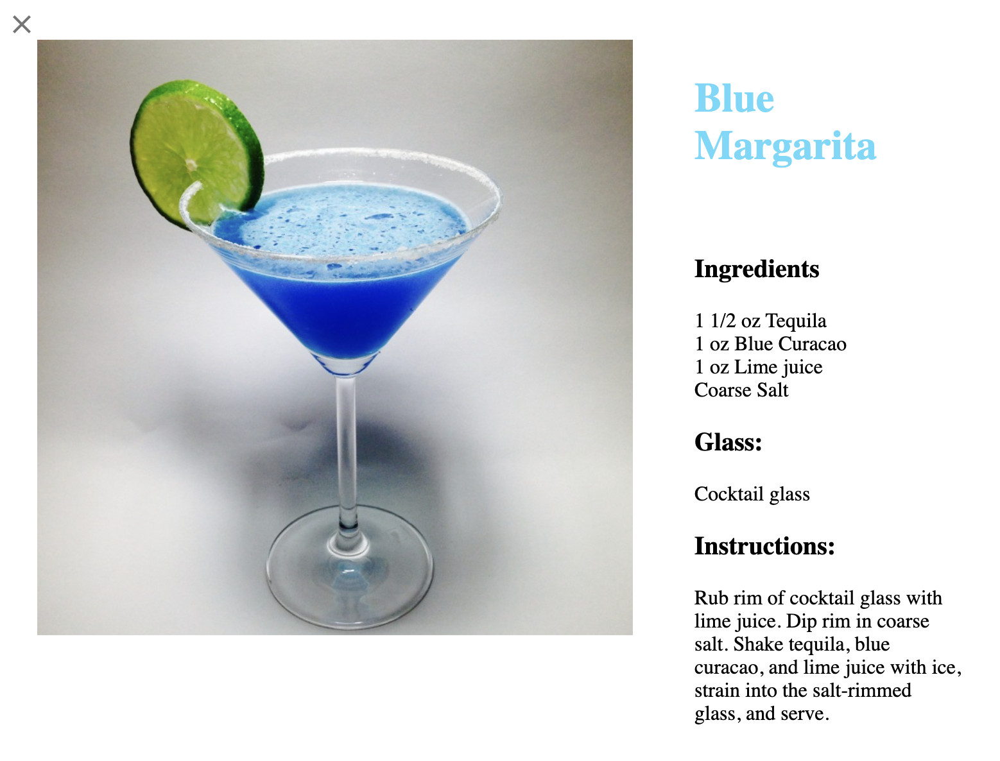

# React Todo Application
> This is a web application that allows you to search for cocktails on the [TheCocktailDB](https://www.thecocktaildb.com/) database. With this application you can learn the ingredients and instructions on how to make many cocktails. 
> Live demo [_here_](https://nostalgic-northcutt-36596e.netlify.app/). <!-- If you have the project hosted somewhere, include the link here. -->

## Table of Contents
* [General Info](#general-information)
* [Technologies Used](#technologies-used)
* [Features](#features)
* [Screenshots](#screenshots)
* [Setup](#setup)
* [Usage](#usage)
* [Project Status](#project-status)
* [Acknowledgements](#acknowledgements)
* [Contact](#contact)
<!-- * [License](#license) -->

## General Information
- I created this project using React. For the API fetch requests I used the axios library. For the styling I used MaterialUI and styled-components.
- I created this project to practice making applications that make asynchronous calls to an API and rendering dynamic data.
- Challenges I faced.
  - Initially I had trouble displaying the unique modals for each cocktail.
  - I learned that when you map to render each individual cocktail you can not have the modal inside of the map function. There can only be one modal and it has to remain outside of the map function. To display each unique cocktail the modal just has to reference the index of the array of cocktails I was mapping.
<!-- You don't have to answer all the questions - just the ones relevant to your project. -->

## Technologies Used
- React - version 17.0.2
- styled-components - version 5.3.3
- MaterialUI - version 5.0.4
- axios - 0.23.0

## Features
List the ready features here:
- A random cocktail is featured on the main landing page
- You can search any cocktail in the search bar
- You can learn more about each individual cocktail
- Responsive Design

## Screenshots

<!-- If you have screenshots you'd like to share, include them here. -->

## Setup
How to install the project.
1. `cd react-bartender-main`
2. `npm i`

## Usage
How does one go about using it?
- `npm start`
- The application should open on your local host on your default web browser.
- To close the application enter `ctrl+c`.

## Project Status
Project is: _complete_ 

## Acknowledgements
Give credit here.
- The hero image is a free stock photo from  [Pexels](https://www.pexels.com/).
<!-- This project was based on [this tutorial](https://www.example.com). -->

## Contact
Created by [@javi](https://javiermelendrez.com/) - feel free to contact me!
